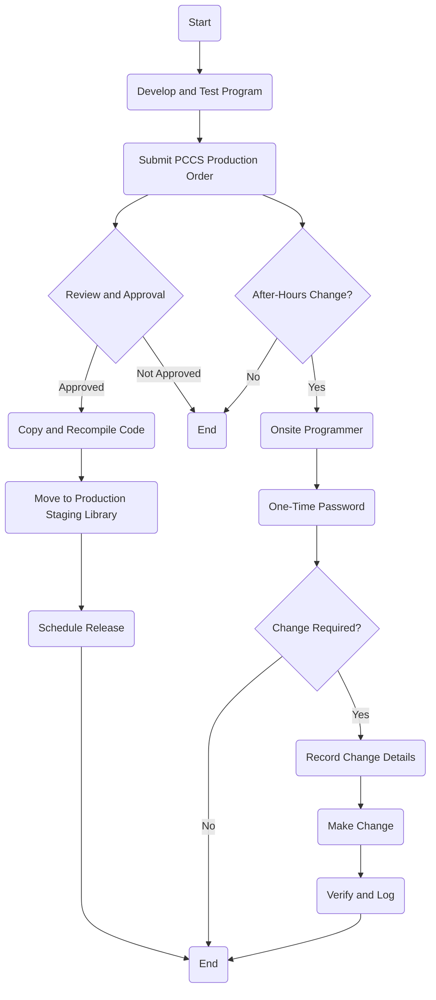

```mermaid
graph TD
    A(Start) --> B(Develop and Test Program)
    B --> C(Submit PCCS Production Order)
    C --> D{Review and Approval}
    D -->|Approved| E(Copy and Recompile Code)
    E --> F(Move to Production Staging Library)
    F --> G(Schedule Release)
    G --> H(End)
    D -->|Not Approved| I(End)
    C --> J{After-Hours Change?}
    J -->|Yes| K(Onsite Programmer)
    J -->|No| I
    K --> L(One-Time Password)
    L --> M{Change Required?}
    M -->|Yes| N(Record Change Details)
    M -->|No| H
    N --> O(Make Change)
    O --> P(Verify and Log)
    P --> H
```
